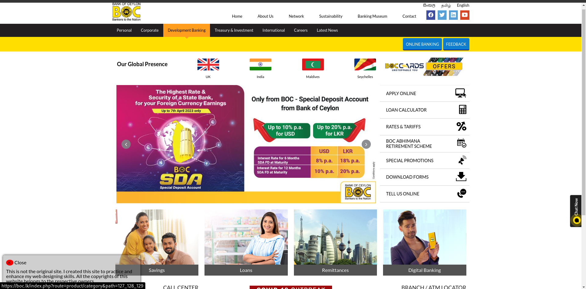

### About The Project

This project is a clone of the Bank of Ceylon(BOC) website, which was designed with the motive of enhancing the web designing skills using pure HTML and CSS. All the images and website layout credits belong to the original designers.

### Build With

### Getting Started
To get a local copy up and running follow the below steps.

#### Prerequisites
- npm 

    `npm install -g npm`

#### Installation
1. open the terminal
2. clone the repo

    `git clone https://github.com/Direct-Entry-Program-09/boc-clone`

3. 
    `npx serve`
### License
License of this project belongs to the respective owners of the original website Bank of Ceylon(BOC).

### Contact

LinkedIn: [www.linkedin.com/in/rashmi-jayasekara](www.linkedin.com/in/rashmi-jayasekara)

Project Link: [https://github.com/Direct-Entry-Program-09/boc-clone](https://github.com/Direct-Entry-Program-09/boc-clone)
